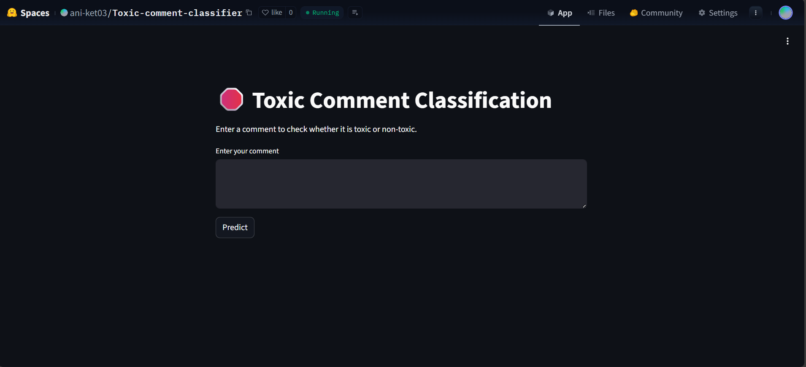
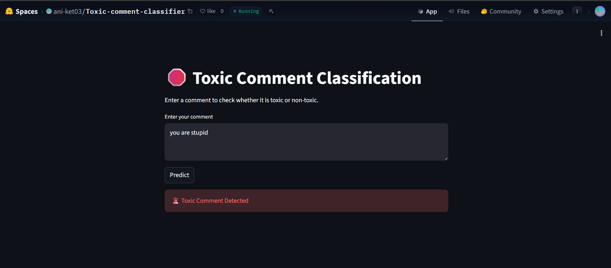
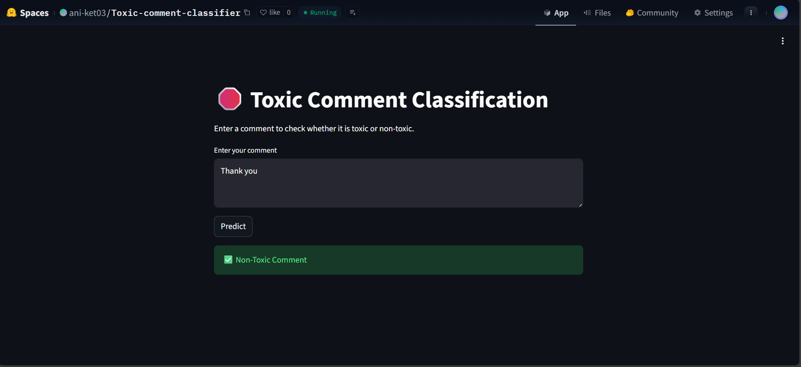

# Toxic Comment Classification using ML & NLP

This project is a Machine Learning and Natural Language Processing (NLP) based application that classifies text comments as **toxic** or **non-toxic**. The system is designed to help identify harmful language in user-generated content.

---

## 🔍 Problem Statement
Online platforms receive a large number of user comments daily. Some of these comments may contain toxic or abusive language. Manual moderation is inefficient, so this project aims to automate toxic comment detection using machine learning.

---

## 🎯 Project Objectives
- To preprocess textual data using NLP techniques  
- To extract meaningful features using TF-IDF  
- To train a machine learning model for toxic comment classification  
- To evaluate the model using standard performance metrics  
- To deploy the model as a web application  

---

## 🧠 Approach
1. Text preprocessing (lowercasing, stopword removal, cleaning)
2. Feature extraction using TF-IDF
3. Model training using Logistic Regression
4. Model evaluation using accuracy, precision, recall, and F1-score
5. Deployment using Streamlit

---

## 🛠️ Tech Stack
- Python  
- Pandas, NumPy  
- NLTK  
- Scikit-learn  
- TF-IDF  
- Logistic Regression  
- Streamlit  
- Google Colab  
- Hugging Face Spaces  

---

## 📊 Dataset
The dataset used is the **Jigsaw Toxic Comment Classification Dataset**, which contains Wikipedia comments labeled for toxicity.  
For simplicity, binary classification (`toxic` / `non-toxic`) is used in this project.

---

## 🚀 Live Demo
👉 https://huggingface.co/spaces/ani-ket03/Toxic-comment-classifier

---

## 🖼️ Screenshots
### Application Home
  or

### Toxic Comment Prediction
  or

### Non-Toxic Comment Prediction
 or 

---

👤 Author

Aniket Kumar
B.Tech Student

📜 License

This project is licensed under the MIT License.

